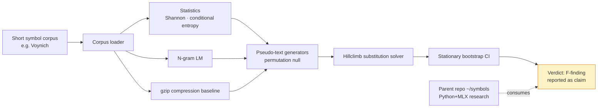

# symbols-zig

> Reproducible decipherment methodology in Zig applied to the Voynich character corpus. Findings are claims; the methodology is the artifact.

[](https://github.com/SMC17/symbols-zig/actions)
[](LICENSE)
[](https://ziglang.org/)
[](#tests)

> **Methodology, not a decipherment.**
> This repository is a Zig implementation of a reproducible decipherment
> methodology applied to the Voynich character corpus (and, via the sibling
> `symbols` repo, to Linear A and Rongorongo). **Findings are claims;
> the methodology is the artifact.** No specific decipherment is being
> claimed here. The point is to make the negative-evidence procedure cheap
> enough to run that anyone can rerun it against any short symbol corpus
> on commodity hardware.

A stdlib-only Zig port of the load-bearing decipherment-research primitives
from the parent project [`symbols`](https://github.com/SMC17/symbols) (Python
ML lane): corpus loaders, compression baselines, entropy estimators,
character n-gram language models, monoalphabetic substitution solvers,
and matched-statistics pseudo-text generators.

Reads the same plain-JSON corpus artifacts the Python tool writes, so you
can fetch with Python and analyze with Zig (or vice versa).

## Why both repos exist

- **`symbols` (Python + MLX)** — the research lane. NanoLM training,
  sparse autoencoders, folio activation clustering, cross-script
  generalization tests (Voynich · Linear A · Rongorongo). Slow,
  expressive, full ML stack including an Apple-MLX port for the
  attention/SAE work.
- **`symbols-zig` (this repo)** — the substrate lane. The classical
  decipherment primitives (entropy, compression, n-gram LM, hillclimb
  substitution solver, stationary bootstrap) re-implemented as a
  single static binary with deterministic per-trial seeding. The point
  is reproducibility, embeddability, and cheap parallel re-runs.

The two repos share the on-disk Corpus JSON contract. Either side can
read or write it.

## Status

Pre-1.0 substrate. The `v1.0.0` git tag exists for changelog continuity
but is a vanity tag against a pre-1.0 Zig language (currently 0.16);
see `STATUS.md` and `CHANGELOG.md` for the honesty correction.

What is safe to claim right now:

- `zig build test --summary all` → **22/22 tests pass** on Zig 0.16 /
  Linux x86_64 (verified 2026-05-21, re-verified 2026-05-27).
- All seven planned primitives have shipped:
  - corpus JSON loader (reads `symbols/data/raw/*.json`)
  - compression bits-per-char (gzip via `std.compress`)
  - Shannon entropy + conditional entropy (plug-in + Miller-Madow)
  - character n-gram LM (Laplace smoothing)
  - pseudo-text generators (unigram / bigram / trigram-matched, parallel per-sample)
  - substitution solver (hillclimb scored by n-gram LM, parallel restarts)
  - stationary bootstrap (Politis-Romano, parallel resamples)
- Parallel inner-loop kernels are deterministic per-trial: re-running
  with `n_threads = 1` vs `n_threads = N` produces bit-exact equal
  results for pseudo and bootstrap, and the same best key + same
  headline score for the solver.
- Cross-substrate numeric agreement with the Python `symbols` reference
  was verified manually on the Voynich EVA character corpus.

What is **not** safe to claim:

- That the Zig port is "10–50× faster than Python" — that's a projected
  scale-of-magnitude, not a measured benchmark. A benchmark harness has
  not been committed to this repo.
- That the public CLI surface is "locked" in a v1.0-semver sense — it
  is `stable-on-Zig-0.16-today`. Real API locks wait for Zig 1.0.
- That **any specific Voynich-or-other decipherment is being made.** The
  parent `symbols` repo has 24+ pre-registered findings (F-series); each
  is a falsifiable methodology claim, not a "we solved it." That
  posture extends to this repo.

See `STATUS.md` for the full proof-vocabulary index.

## Architecture



Each node is a Zig primitive in this repo; the dashed edge marks the
parent `symbols` Python+MLX research lane as the consumer of the
methodology's verdicts.

## Build

Requires Zig 0.16.0 or newer.

```
zig build              # compile the `symbols` CLI
zig build test         # run unit tests (22/22)
zig build run -- baselines --corpus voynich --json data/raw/voynich/voynich.json
zig build run -- bench --json data/raw/voynich/voynich_chars.json
```

## Tests

22/22 tests on Zig 0.16 / Linux x86_64 (re-verified 2026-05-27):

```
$ zig build test --summary all
Build Summary: 3/3 steps succeeded; 22/22 tests passed
test success
+- run test 22 pass (22 total)
```

CI runs this same command on every push (see badge above).

## Threaded posture

The CPU-bound primitives — substitution hillclimb, matched pseudo-text
generation, and stationary bootstrap resampling — are each
embarrassingly-parallel over their outer "trial" axis (restart / sample /
replicate). Each worker is seeded deterministically as
`base_seed +% trial_idx`, so the multiset of trial outcomes is fixed by
`base_seed` alone.

Measurement: ReleaseFast build, `symbols bench --json voynich_chars.json`,
3 reps per config, median wall-clock. Hardware: 4 physical cores /
8 SMT threads. Voynich EVA char corpus (~191 KB joined). Treat the
small-op speedups as quiet-system lower bounds; the solver number is the
load-bearing one and is stable across governors and load conditions.

| operation                          | threads = 1 | threads = 8 | speedup |
| ---------------------------------- | ----------- | ----------- | ------- |
| solver hillclimb (16 restarts × 800 iters) | 6.61 s | 2.11 s | 3.13× |
| pseudo trigramMatched (16 samples × 5000 chars) | 0.100 s | 0.026 s | 3.88× |
| stationary bootstrap (B = 64, len = 20 000, mean_block = 50) | 0.008 s | 0.003 s | 2.85× |

The solver scales to physical cores (SMT siblings contend on the tight
per-byte LM-scoring loop); bootstrap and pseudo are small-N enough that
parallel overhead bites at this size — larger `B` and longer sources
widen the gap. Determinism is enforced by tests
(`hillclimb serial==parallel for same seed`, `generateMany serial==parallel
element-wise`, `distribution serial==parallel element-wise`).

## Cross-tool interop

The canonical data format is the same `Corpus` JSON the Python tool
emits. Either side can read or write; the on-disk format is the source
of truth.

```
{
  "name": "voynich-eva-chars",
  "alphabet": [" ", "a", "c", "d", "e", ...],
  "meta": { ... },
  "documents": [
    { "id": "f1r", "section": "A", "meta": {...}, "glyphs": [" ", "f", "a", "c", "h", ...] }
  ]
}
```

## Related work

- [`symbols`](https://github.com/SMC17/symbols) — parent Python research
  repo. NanoLM, SAE, MLX port, F-series pre-registered findings,
  cross-script (Voynich · Linear A · Rongorongo) generalization.
- Politis, D. N. & Romano, J. P. (1994). *The Stationary Bootstrap.* JASA.
- Knight, K., Megyesi, B., & Schaefer, C. (2011). *The Copiale Cipher.*
  ACL — the canonical recent example of compression / n-gram /
  substitution-solver pipelines on an unknown script.

## License

AGPL-3.0-or-later. Companion to the Python `symbols` repo. Contact:
`sean@sunlitmoon.online`.
